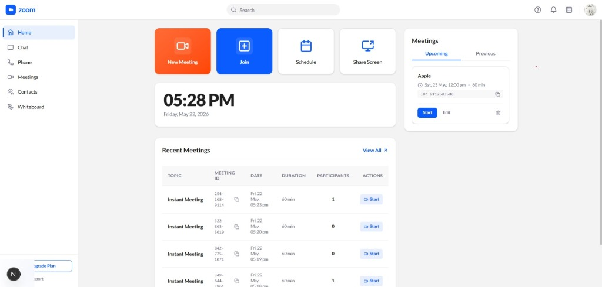
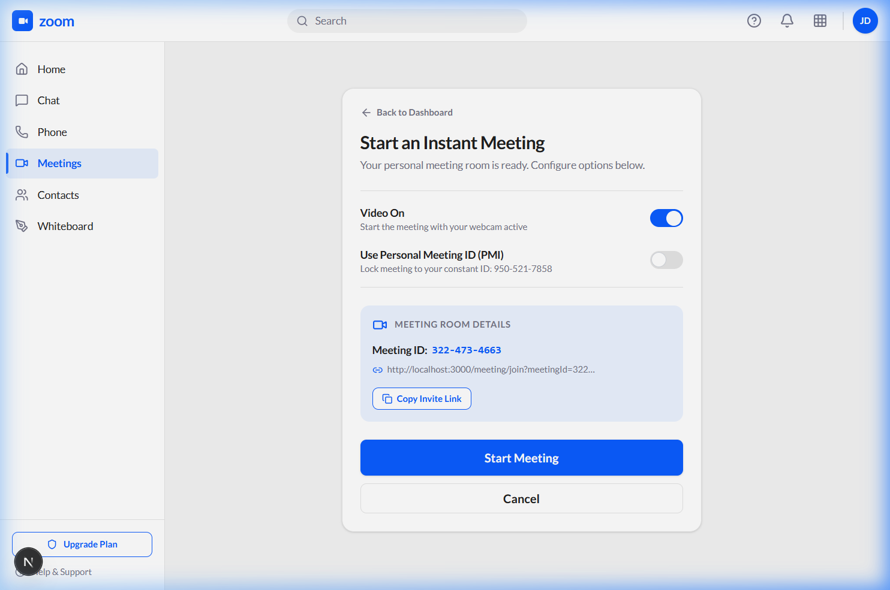
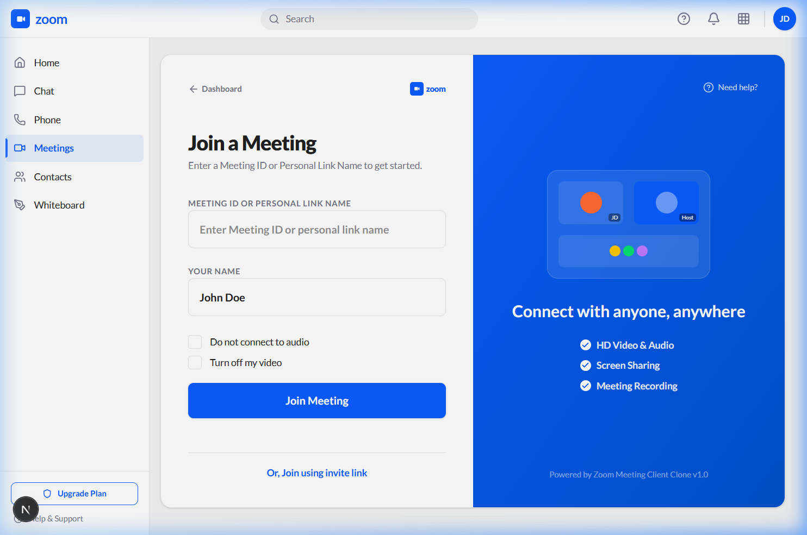
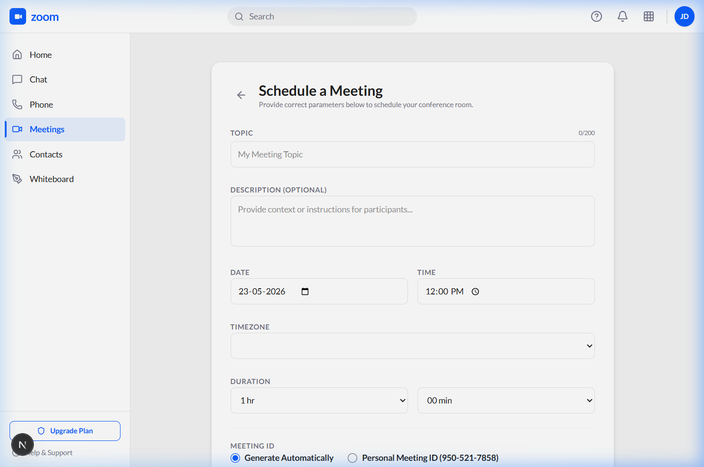

# Zoom Clone — Full-Stack Video Conferencing Platform

> **SDE Intern Full-Stack Assignment Submission**

A production-quality, full-stack video conferencing web application that replicates Zoom's design language, user experience, and core meeting workflows. Built with **Next.js 14**, **FastAPI (Python)**, **SQLite**, and **WebRTC** for real-time peer-to-peer audio and video streaming.


---

## Table of Contents

1. [Overview](#overview)
2. [Screenshots](#screenshots)
3. [Key Features](#key-features)
4. [System Architecture](#system-architecture)
5. [Database Design](#database-design)
6. [Installation & Setup](#installation--setup)
7. [Usage](#usage)
8. [API Documentation](#api-documentation)
9. [Project Structure](#project-structure)
10. [Business Logic & Security Rules](#business-logic--security-rules)
11. [Assumptions Made](#assumptions-made)
12. [Author](#author)

---

## Overview

This Zoom Clone was built to satisfy all core and bonus requirements of the Full-Stack SDE Intern assignment. The application mirrors Zoom's professional dashboard, meeting room, scheduling flow, and participant management workflows.

### Problem Statement
- Users need a clean, professional dashboard to manage upcoming and recent meetings.
- Meeting hosts must have a simple flow to create, share, and start video rooms instantly.
- Participants need to join seamlessly via Meeting ID or an invite link with display name entry.
- The system must persistently store all meetings and participants in a relational database.

### Solution
A two-process full-stack architecture — a **Next.js 14** SPA frontend communicating with a **FastAPI** async Python backend — that stores all data in **SQLite** and uses the browser's native **WebRTC API** for real-time peer-to-peer media streaming brokered through a **WebSocket signaling server**.

---

## Screenshots

### 1. Dashboard (Home)
The main Zoom-style dashboard with quick-action buttons, a live clock, upcoming meetings panel, and sortable recent meetings table.



---

### 2. Start an Instant Meeting
Configure camera and PMI preferences, generate a shareable invite link, and launch directly into the meeting room.



---

### 3. Join a Meeting
Enter a 10-digit Meeting ID or paste an invite link, set your display name, and toggle audio/video before entering.



---

### 4. Schedule a Meeting
Full scheduling form with title, date/time picker, duration, passcode, waiting room, video preferences, and Google/Outlook calendar export.



---

### 5. Meetings List — Upcoming & Previous Tabs
Manage all meetings with Start, Edit, Delete, and Copy Invitation actions. Tabs for Upcoming, Previous, Personal Room, and Templates.


---

## Key Features

### ✅ Core Features (Required)

#### 1. Landing Dashboard
- Clean, professional **Zoom-identical UI** with sidebar navigation (Home, Chat, Phone, Meetings, Contacts, Whiteboard).
- Live clock showing current time and date.
- Quick-action buttons: **New Meeting**, **Join**, **Schedule**, **Share Screen**.
- **Upcoming Meetings** panel on the right showing the next scheduled session with Start / Edit / Delete controls.
- **Recent Meetings** table sorted by the most recently conducted or ended meeting first (instantly-started meetings always appear above older scheduled ones regardless of their scheduled date).

#### 2. Instant Meeting Creation
- One-click meeting creation with an auto-generated 10-digit **Meeting ID** (e.g., `144-341-9400`).
- Option to use a persistent **Personal Meeting ID (PMI)**.
- Shareable **invite link** generated automatically (`/meeting/join?meetingId=...`).
- Redirects directly into the live meeting room upon start.

#### 3. Join Meeting
- Join via **Meeting ID** or by pasting an invite link.
- Enter a **display name** before joining (pre-filled from profile store).
- Toggles to disable audio or video before entering.
- Validates meeting existence and status — rejected if meeting has ended.
- Prompts for **passcode** if the meeting is passcode-protected.

#### 4. Schedule Meetings
- Full scheduling form with: Title, Description, Date & Time picker, Duration selector.
- Security options: **Passcode** (auto-generated, editable) and **Waiting Room** toggle.
- Video options: Host Video On/Off, Participant Video On/Off.
- **Calendar export**: Google Calendar, Outlook, Copy Details.
- Scheduled meetings persist in SQLite and appear immediately in the Upcoming Meetings section.

---

### ⭐ Bonus Features Implemented

| Feature | Status |
|---|---|
| Responsive Design (mobile / tablet / desktop) | ✅ Implemented |
| Host Controls — Mute All Participants | ✅ Implemented |
| Host Controls — Remove / Kick Participant | ✅ Implemented |
| Host Controls — Mute Individual Participant | ✅ Implemented |
| Real-time WebRTC Video & Audio Streaming | ✅ Implemented |
| Waiting Room Queue with Host Admit | ✅ Implemented |
| Screen Sharing | ✅ Implemented |
| Persistent In-Room Chat | ✅ Implemented |
| Floating Emoji Reactions | ✅ Implemented |
| End Meeting for All (Host) | ✅ Implemented |
| Gallery View & Speaker View toggle | ✅ Implemented |
| Secure Host Identity (token-based, anti-impersonation) | ✅ Implemented |

---

## System Architecture

### Technology Stack

#### Frontend
- **Next.js 14** (App Router) — Single Page Application with server and client components.
- **React 18** with functional components, `useRef`, `useState`, `useEffect`, `useCallback` hooks.
- **Tailwind CSS** — utility-first styling matching Zoom's clean white/blue design language.
- **WebRTC API** — `RTCPeerConnection`, `getUserMedia`, `getDisplayMedia` for P2P streaming.
- **WebSocket Client** — for real-time signaling (SDP offers/answers, ICE candidates, status broadcasts).
- **Lucide React** — icon library for UI controls.

#### Backend
- **Python 3.10+** with **FastAPI** — async REST API and WebSocket gateway.
- **SQLAlchemy ORM** — object-relational mapping over SQLite.
- **Uvicorn** — ASGI server for high-throughput async execution.
- **FastAPI WebSockets** — persistent, bidirectional signaling channels per meeting room.

#### Database
- **SQLite** — lightweight relational database. File: `backend/zoom_clone.db` (auto-created on first run).

### System Flow

```
Browser (Next.js)
      │
      ├── REST API calls ──────────► FastAPI /api/* routes
      │                                     │
      │                              SQLAlchemy ORM
      │                                     │
      │                             SQLite Database
      │
      └── WebSocket ──────────────► /api/meetings/{uuid}/ws/{participant_id}
                                          │
                                    Signaling Broker
                                    (offer / answer /
                                     ICE / broadcast)
                                          │
                    ◄─────────── Peer A ◄═══════► Peer B ──────────►
                                       WebRTC P2P
                                    (video/audio tracks)
```

---

## Database Design

The schema was designed from scratch to support Zoom's core data model: meetings own participants, and meetings own chat messages. All foreign key relationships use cascade deletion to avoid orphaned rows.

### Entity Relationship Model

```
Meetings (1 : N) ──────────► Participants
    │
    └── (1 : N) ──────────► ChatMessages
```

### Table: `meetings`

| Column | Type | Constraints | Description |
|---|---|---|---|
| `id` | INTEGER | PRIMARY KEY | Auto-increment |
| `meeting_uuid` | VARCHAR | UNIQUE, NOT NULL | Internal UUID for URL routing |
| `meeting_id` | VARCHAR | UNIQUE, NOT NULL | Human-readable display ID (e.g., `123-456-7890`) |
| `title` | VARCHAR | NOT NULL | Meeting title / topic |
| `host_name` | VARCHAR | NOT NULL | Display name of the creator |
| `passcode` | VARCHAR | NULLABLE | Optional join passcode |
| `waiting_room_enabled` | BOOLEAN | DEFAULT false | Whether to queue participants |
| `host_video_on` | BOOLEAN | DEFAULT true | Default host camera state |
| `participant_video_on` | BOOLEAN | DEFAULT false | Default participant camera state |
| `meeting_type` | VARCHAR | DEFAULT 'instant' | `instant` or `scheduled` |
| `start_time` | DATETIME | NULLABLE | Scheduled start time |
| `duration` | INTEGER | DEFAULT 60 | Meeting duration in minutes |
| `status` | VARCHAR | DEFAULT 'active' | `active`, `scheduled`, or `ended` |
| `created_at` | DATETIME | DEFAULT now | Row creation timestamp |

### Table: `participants`

| Column | Type | Constraints | Description |
|---|---|---|---|
| `id` | INTEGER | PRIMARY KEY | Auto-increment |
| `meeting_id` | INTEGER | FK → meetings.id (CASCADE) | Parent meeting |
| `name` | VARCHAR | NOT NULL | Participant display name |
| `role` | VARCHAR | DEFAULT 'participant' | `host` or `participant` |
| `is_muted` | BOOLEAN | DEFAULT false | Current mute state |
| `video_on` | BOOLEAN | DEFAULT true | Current video state |
| `avatar_color` | VARCHAR | NULLABLE | Deterministic color for avatar tile |
| `approved` | BOOLEAN | DEFAULT true | `false` = in waiting room queue |
| `joined_at` | DATETIME | DEFAULT now | Join timestamp |

### Table: `chat_messages`

| Column | Type | Constraints | Description |
|---|---|---|---|
| `id` | INTEGER | PRIMARY KEY | Auto-increment |
| `meeting_id` | INTEGER | FK → meetings.id (CASCADE) | Parent meeting |
| `sender_name` | VARCHAR | NOT NULL | Message author display name |
| `content` | TEXT | NOT NULL | Message body |
| `timestamp` | DATETIME | DEFAULT now | When the message was sent |

### Key Design Decisions
- **UUID vs Integer ID**: Meetings have both a UUID (safe for URLs) and a formatted integer ID (user-visible for joining), separating security from usability.
- **Cascade Deletes**: Deleting a meeting removes all its participants and chat messages automatically — no orphaned data.
- **Role-Based Participant**: The `role` column (not a separate table) cleanly separates host from participants within the same relation.
- **Approved Flag**: The waiting room is modelled as a soft-filter (`approved = false`) on the participants table rather than a separate queue table, keeping joins simple.

---

## Installation & Setup

### Prerequisites
- **Node.js** v18 or higher
- **Python** v3.10 or higher
- **Git**

### Step 1 — Clone the Repository
```bash
git clone https://github.com/sheetanshumohan/AI-Interview-Preparation-Platform.git
cd zoom_clone_project
```

### Step 2 — Backend Setup

```bash
cd backend

# Create and activate virtual environment
python -m venv venv

# Windows
.\venv\Scripts\activate
# macOS / Linux
source venv/bin/activate

# Install dependencies
pip install -r requirements.txt

# Start the backend server (auto-creates zoom_clone.db)
python main.py
```

The FastAPI server starts at **http://localhost:8000**.  
Interactive API docs: **http://localhost:8000/docs**

### Step 3 — Frontend Setup

```bash
cd ../frontend

# Install dependencies
npm install

# Start the development server
npm run dev
```

The Next.js app starts at **http://localhost:3000**.

> **Note**: The frontend proxies all `/api/*` requests to `http://localhost:8000` via `next.config.js`. Both servers must be running simultaneously.

### Environment Variables (Optional)

The app works out of the box with defaults. To customize, create a `.env.local` in `frontend/`:

```
NEXT_PUBLIC_API_URL=http://localhost:8000
```

---

## Usage

### For Hosts — Creating a Meeting

1. Open **http://localhost:3000** — the dashboard loads with a default profile ("N" avatar).
2. Click **New Meeting** → configure camera preference and PMI option → click **Start Meeting**.
3. You are redirected to the meeting room with full **Host Controls** (Mute All, Waiting Room, Security, Reactions, End for All).
4. Share the displayed **Meeting ID** or copy the invite link for participants to join.

### For Participants — Joining a Meeting

1. Click **Join** from the dashboard.
2. Enter the 10-digit **Meeting ID** (or paste the full invite link).
3. Type your **Display Name** → adjust audio/video toggles → click **Join Meeting**.
4. If the meeting has a passcode, you are prompted to enter it.
5. If the Waiting Room is enabled, you wait until the host admits you.

### Scheduling a Meeting

1. Click **Schedule** from the dashboard.
2. Fill in **Title**, **Date & Time**, **Duration**, **Passcode**, and **Video preferences**.
3. Click **Save** — the meeting appears immediately in the **Upcoming Meetings** sidebar and the **Meetings → Upcoming** tab.
4. When ready, click **Start** from either location to launch the room.

---

## API Documentation

### Meeting Endpoints

| Method | Endpoint | Description |
|---|---|---|
| `GET` | `/api/meetings/upcoming` | List all scheduled upcoming meetings |
| `GET` | `/api/meetings/recent` | List recent/ended meetings sorted by activity |
| `POST` | `/api/meetings` | Create a new instant or scheduled meeting |
| `GET` | `/api/meetings/{uuid}` | Fetch full details of a specific meeting |
| `PATCH` | `/api/meetings/{uuid}` | Update meeting title, time, settings |
| `DELETE` | `/api/meetings/{uuid}` | Delete a meeting and all its participants |
| `POST` | `/api/meetings/{uuid}/end` | End the meeting for all participants |
| `POST` | `/api/meetings/{uuid}/join-validate` | Validate Meeting ID, passcode, and status |

### Participant Endpoints

| Method | Endpoint | Description |
|---|---|---|
| `POST` | `/api/meetings/{uuid}/participants` | Register a participant (join) |
| `GET` | `/api/meetings/{uuid}/participants` | List all participants in a meeting |
| `DELETE` | `/api/meetings/{uuid}/participants/{id}` | Remove / kick a participant |
| `PATCH` | `/api/meetings/{uuid}/participants/{id}/mute` | Toggle mute state for a participant |
| `POST` | `/api/meetings/{uuid}/participants/mute-all` | Mute all non-host participants |
| `POST` | `/api/meetings/{uuid}/participants/{id}/admit` | Admit a participant from waiting room |

### Chat Endpoints

| Method | Endpoint | Description |
|---|---|---|
| `GET` | `/api/meetings/{uuid}/chat` | Fetch all chat messages for a meeting |
| `POST` | `/api/meetings/{uuid}/chat` | Send a new chat message |

### WebSocket Gateway

```
WS  /api/meetings/{meeting_uuid}/ws/{participant_id}
```

**Message Types Handled:**

| Type | Direction | Description |
|---|---|---|
| `offer` | Peer → Peer | WebRTC SDP offer (initiates connection) |
| `answer` | Peer → Peer | WebRTC SDP answer |
| `ice-candidate` | Peer → Peer | ICE candidate exchange |
| `status_change` | Broadcast | Audio/video state update |
| `participant_joined` | Broadcast | New participant entered room |
| `participant_ready` | Broadcast | Admitted participant's media is ready |
| `participant_left` | Broadcast | Participant disconnected |
| `waiting_room_join` | Broadcast | Participant is queued in waiting room |
| `waiting_room_admit` | Broadcast | Host admitted a waiting participant |
| `screen_share_change` | Broadcast | Screen sharing started/stopped |
| `chat_message` | Broadcast | New chat message |
| `reaction` | Broadcast | Floating emoji reaction |
| `meeting_ended` | Broadcast | Host ended the meeting for all |

---

## Project Structure

```
zoom_clone_project/
│
├── screenshots/                    # UI screenshots for README
│
├── backend/
│   ├── models/
│   │   ├── __init__.py
│   │   ├── meeting.py              # Meeting SQLAlchemy model
│   │   ├── participant.py          # Participant model
│   │   └── chat.py                 # ChatMessage model
│   │
│   ├── routers/
│   │   ├── meetings.py             # Meeting CRUD + lifecycle endpoints
│   │   ├── participants.py         # Participant management endpoints
│   │   └── websocket.py            # WebRTC signaling & broadcast gateway
│   │
│   ├── database.py                 # SQLite connection, session factory, table init
│   ├── main.py                     # FastAPI app bootstrap + CORS + router inclusion
│   ├── requirements.txt            # Python dependencies
│   └── zoom_clone.db               # SQLite database (auto-created on first run)
│
├── frontend/
│   ├── app/
│   │   ├── (dashboard)/            # Authenticated dashboard layout group
│   │   │   ├── layout.tsx          # Sidebar + top bar shell
│   │   │   ├── dashboard/
│   │   │   │   └── page.tsx        # Main home dashboard
│   │   │   ├── meetings/
│   │   │   │   ├── page.tsx        # Meetings list (Upcoming / Previous tabs)
│   │   │   │   └── [meetingId]/
│   │   │   │       └── page.tsx    # Individual meeting detail page
│   │   │   ├── meeting/
│   │   │   │   ├── new/page.tsx    # Instant meeting creation flow
│   │   │   │   ├── join/page.tsx   # Join by Meeting ID
│   │   │   │   └── schedule/page.tsx  # Schedule meeting form
│   │   │   └── chat/page.tsx       # Chat placeholder (Zoom sidebar nav)
│   │   │
│   │   ├── meeting/
│   │   │   └── room/
│   │   │       └── [meetingId]/
│   │   │           └── page.tsx    # ⭐ Core WebRTC video room (1892 lines)
│   │   │
│   │   └── page.tsx                # Root redirect → /dashboard
│   │
│   ├── components/
│   │   ├── dashboard/
│   │   │   ├── UpcomingPanel.tsx   # Right sidebar upcoming meetings widget
│   │   │   └── RecentMeetings.tsx  # Dashboard recent meetings table
│   │   │
│   │   └── meeting/
│   │       ├── ParticipantGrid.tsx # Video tile layout (Gallery/Speaker view)
│   │       ├── ControlBar.tsx      # Camera, mic, screen share, reactions toolbar
│   │       ├── ChatPanel.tsx       # Slide-in chat drawer
│   │       ├── ParticipantsPanel.tsx   # Participants list with host controls
│   │       ├── SecurityPanel.tsx   # Meeting lock / passcode / waiting room panel
│   │       ├── LeaveModal.tsx      # Leave / End for all confirmation modal
│   │       ├── PollsModal.tsx      # In-meeting polls modal
│   │       └── SettingsModal.tsx   # Audio/video device settings
│   │
│   ├── lib/
│   │   ├── api.ts                  # Typed API client (all fetch calls)
│   │   └── utils.ts                # Date parsing, ID formatting utilities
│   │
│   ├── next.config.js              # API proxy rewrite to localhost:8000
│   ├── tailwind.config.js
│   └── package.json
│
└── README.md
```

---

## Business Logic & Security Rules

### Host Identity Verification (Anti-Impersonation)
The application uses a **dual-verification** strategy to prevent a participant from claiming host privileges by entering the same display name as the host:

1. When a host starts a meeting from any dashboard entry point, the browser stores a scoped token: `localStorage.setItem("meeting_host_${meetingUuid}", "true")`.
2. Inside the meeting room, host status is only granted if **both** conditions are true:
   - The participant's display name matches the meeting's `host_name` in the database.
   - The participant's browser has the matching `meeting_host_${uuid}` token.
3. On the backend, participant lookup matches on **both name and role** to prevent a second user with the same name from inheriting the host's existing database row.

### WebRTC Connection Lifecycle (Fixing the Race Condition)
A race condition existed where peers would initiate WebRTC connections before the newly-admitted participant's camera was ready, resulting in blank video tiles:

**Before fix**: Host sends `offer` immediately upon receiving `waiting_room_admit`.  
**After fix**:
1. Admitted participant finishes `getUserMedia()` (camera/mic initialization).
2. Participant broadcasts `participant_ready` signal.
3. **Only then** does the host create the `RTCPeerConnection` and send the SDP offer.

This guarantees both sides have active local media tracks before track negotiation begins.

### Recent Meetings Sort Order
Meetings in the Recent section are sorted by **when the meeting was actually conducted** — not by `start_time` (which represents the scheduled date). This ensures an instant meeting started today always appears above a scheduled meeting from yesterday or a future date that was started earlier.

### Waiting Room
- Participants who join a waiting-room-enabled meeting get `approved = false` in the database.
- A `waiting_room_join` broadcast notifies the host.
- Host calls the `/admit` endpoint → sets `approved = true` → broadcasts `waiting_room_admit`.
- Admitted participant initializes media and emits `participant_ready`.
- All existing room participants initiate WebRTC offers to the newly admitted peer.

---

## Assumptions Made

1. **No Authentication Required**: A default user profile is assumed to be logged in. The display name is stored in `localStorage` under the key `zoom_clone_profile` and pre-filled on all join/start forms.
2. **Single-Tab Host**: Host privileges are scoped to the browser tab/instance that created the meeting. Opening the same meeting in another tab without the `localStorage` token grants participant-level access only.
3. **P2P WebRTC (Mesh)**: The implementation uses a full-mesh peer-to-peer topology. For large meetings (10+ participants), a server-side media relay (SFU) like mediasoup would be needed for scalability — out of scope for this assignment.
4. **STUN Only**: ICE candidate discovery uses Google's public STUN servers. Participants behind symmetric NATs may require a TURN relay server for connectivity.
5. **SQLite for Storage**: All data is stored in a local SQLite file. This is sufficient for development and evaluation; PostgreSQL would be used for production deployment.
6. **Local Network Video**: WebRTC streams function correctly on the same machine or local network. Cross-network operation requires public TURN servers.

---

## Author

**Kush Agarwal**

---

*This project was developed as part of the SDE Intern Full-Stack Assignment. All code is original work.*
